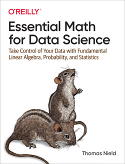

# Essential Math for Data Science

[](https://mybinder.org/v2/gh/sebastianstupak/essential-math-for-data-science/HEAD?labpath=notebook){:target="\_blank"}

<div style="display: flex; align-items: flex-start;">
  <a href="https://www.oreilly.com/library/view/essential-math-for/9781098102920/" target="_blank">
    
  </a>
  <div>
    Accompanying math from book <a href="https://www.oreilly.com/library/view/essential-math-for/9781098102920/" target="_blank">Essential Math for Data Science by Thomas Nield</a>.

    This repository is not affiliated with Thomas Nield, the book "Essential Math for Data Science", or O'Reilly.
    Repository was made for personal learning purposes.

  </div>
</div>

## Setup

Setup [python virtual environment](https://packaging.python.org/en/latest/guides/installing-using-pip-and-virtual-environments/).

Create a virtual environment:

```bash
python3 -m venv .venv
```

Activate a virtual environment:

```bash
source .venv/bin/activate
```

Confirm virtual environment is activated:

```bash
which python
```

Install project dependencies from a requirement file:

```bash
python3 -m pip install -r requirements.txt
```
